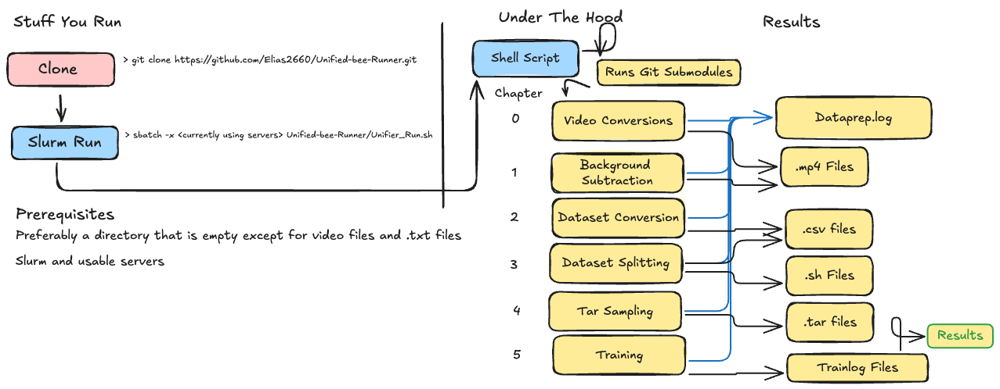

# Unified Bee Runner

Unified Bee Runner is a pipeline for processing and analyzing bee-related datasets. This project includes several steps such as dataset creation, video conversion, data splitting, and model training. The model is meant to run on ilab, and through slurm.

## Pipeline



## Table of Contents

- [Installation](#installation)
- [Usage](#usage)
- [Pipeline Steps](#pipeline-steps)
- [Contributing](#contributing)
- [License](#license)

## Installation

1. Clone the repository:

   ```sh
   git clone https://github.com/yourusername/Unified-Bee-Runner.git
   cd Unified-Bee-Runner
   ```

## Usage

To run the pipeline, use the provided shell script in SLURM. If you don't want to, please copy the Unifier_Run.sh file and execute it in your command line:

Run `squeue -u <user>` to be able to find your current jobs and the servers that they are running on.

Then run:

```sh
sbatch -x [servers, such as server1,server2] Unified-bee-Runner/Unifier_Run.sh
```

## Pipeline Steps

1. `Video Conversion`: Converts .h264 videos to .mp4 format.
2. `Dataset Creation`: Clones the Dataset_Creator repository and creates the dataset.
3. `Data Splitting`: Splits the data into training and testing sets.
4. `Video Sampling`: Clones the VideoSamplerRewrite repository and samples the video frames.
5. `Model Training`: Runs the model training script.

## Contributing

Contributions are welcome! Please open an issue or submit a pull request.

## License

This project is licensed under the [MIT License](LICENSE).
